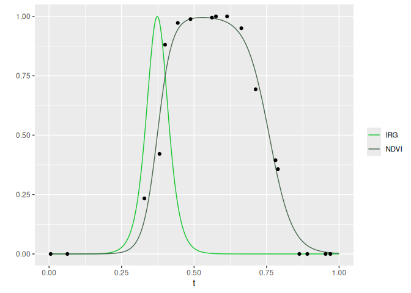

[](https://www.repostatus.org/#active)
[](https://www.tidyverse.org/lifecycle/#maturing)
[](https://github.com/robitalec/irg)
[](https://cran.r-project.org/package=irg)
[](https://gitlab.com/robit.a/irg/commits/master)
[](https://codecov.io/gl/robit.a/irg)

# irg

`irg` is an R package for calculating the instantaneous rate of green-up
(IRG). It can be used to fit a double logistic curve to a time series of
normalized difference vegetation index (NDVI) and calculate IRG, as
described in Bischoff et al. (2012) [\[1\]](#references). Remote sensing
imagery from MODIS is collected frequently with high temporal resolution
(albeit with lower spatial resolution than LANDSAT). IRG helps identify
the timing of green-up and can be used to determine if migratory animals
are “surfing” a green-wave of high quality forage or if non-migratory
animals are selecting available resources at the peak IRG in their
environments.

## Approach

The `irg` package opts for a tabular calculation of IRG as opposed to a
raster based approach. Sampling MODIS imagery is left up to the user and
a prerequisite for all functions. The main input (`DT`) for all
functions is a [`data.table`](https://github.com/Rdatatable/data.table)
of an NDVI time series. The sampling unit (`id`) is flexible (a decision
for the user) though we would anticipate points or polygons, or maybe a
pixel. All functions leverage the speed of `data.table` to efficiently
filter, scale, and model NDVI time series and calculate IRG.

More details in the first vignette: [Getting started with
IRG](http://irg.robitalec.ca/articles/getting-started-with-irg.html).

## Installation

Install with [`remotes`](https://github.com/r-lib/remotes).

``` r
remotes::install_gitlab('robit.a/irg')
```

## Usage

IRG is calculated by filtering an NDVI time series, scaling variables,
modeling the time series with a double logistic curve and taking the
first derivative of this curve.

Here, we use the meta function `irg`. Alternatively, use the filtering,
scaling, modeling and IRG functions separately (see [Getting started
with
IRG](http://irg.robitalec.ca/articles/getting-started-with-irg.html)).

``` r
library(data.table)
library(ggplot2)
library(irg)

# Load package data
ndvi <- fread(system.file("extdata", "ndvi.csv", package = "irg"))

# Calculate IRG using example data: a raw NDVI time series
IRG <- irg(ndvi)

# Plot one year for one individual (please excuse the manual color scale)
ggplot(IRG[yr == 2007 & id == 12377]) +
    geom_line(aes(t, irg, color = '#14c62f'), show.legend = TRUE) +
    geom_line(aes(t, fitted, color = '#47694d'), show.legend = TRUE) +
    scale_color_identity("", labels = c('NDVI', 'IRG'), guide = 'legend') + 
    labs(y = '')
```



## Functions


## Contributing

Contributions welcome\! See details in
[CONTRIBUTING.md](CONTRIBUTING.md).

Please note that the `irg` package is released with a [Contributor Code
of Conduct](CODE_OF_CONDUCT.md). By contributing to this package, you
agree to abide by its terms.

## Thanks

To [Mike Laforge](https://mammalspatialecology.weebly.com/)
([@MamlSpatialEco](https://twitter.com/MamlSpatialEco)) and [Eric Vander
Wal](https://weel.gitlab.io) for thoughtful discussion that stimulated
development of this package.

## References

[\[1\]](https://www.journals.uchicago.edu/doi/abs/10.1086/667590)
Bischof, R., Loe, L. E., Meisingset, E. L., Zimmermann, B., Van Moorter,
B., & Mysterud, A. (2012). A migratory northern ungulate in the pursuit
of spring: jumping or surfing the green wave? *The American Naturalist*,
180(4), 407-424.
